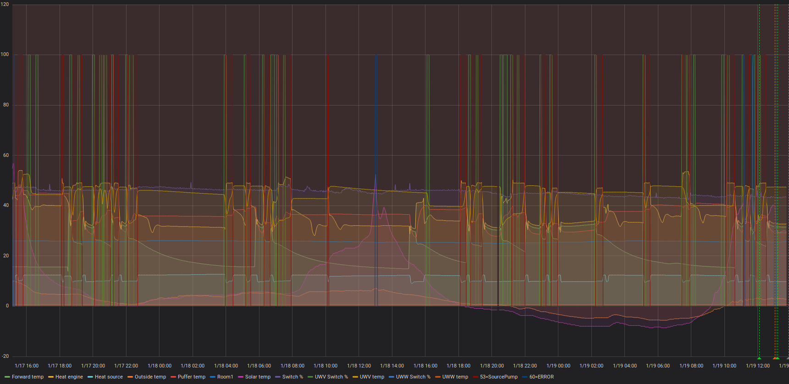

# pcoweb-client: a Carel pCOWeb card ModBus client as a Prometheus metric exporter
This is a simple ModBus client for Carel [pCOWeb cards](https://www.carel.com/bms-building-management-system-na/-/journal_content/56_INSTANCE_i4q5KIMLInKK/10191/55239).

It retrieves the ModBus bits and analogue measurements, exposes them as Prometheus metrics,
and logs the changes.

It is configurable to send an alert email if certain bits has been set.

One configuration is included:

## Rehau Aqua11C

| Analogue  | Name  |
|---|---|
|  1 | Heat engine temp  |
|  2 |  Heat source temp |
|  3 |  Outside temp |
| 4 | Puffer temp |
| 6 | Room1 |
| 7 | Switch % |
| 8 | Forward temp |
| 9 | UWW temp |
| 15 | Solar temp |
| 30 | UWW Switch % |

| Bit  | Name  |
|---|---|
| 7  | Forward heating  |
| 8  | UWW  |
| 39  | Heat pump  |
| 53 | Source pump |
| 54 | UWW circulation |
| 56 | Makw UWW |
| 60 | ERROR |

**WARNING!** This is an *experimental* mapping!
I've paired the analogue values with the values that can be read on the heat pump,
and the bits by inspecting the changes in the bit's value and the analogue values.

# Home-Assistant
## Installation and configuration

1. Add the repository. (Quick link:  )
    * **Add the repository** (click 3 dots on the top right of the screen). Repository URL: *https://github.com/tgulacsi/pcosweb-client*
    * Refresh/reload your browser tab/window

2. **Install** the add-on:
    * Find, and **install** the PCOSWeb Client add-on
